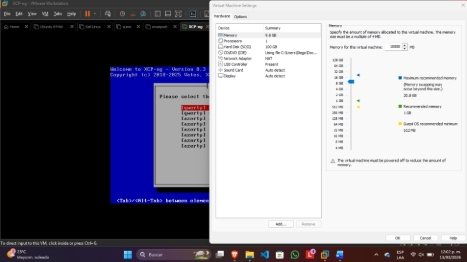
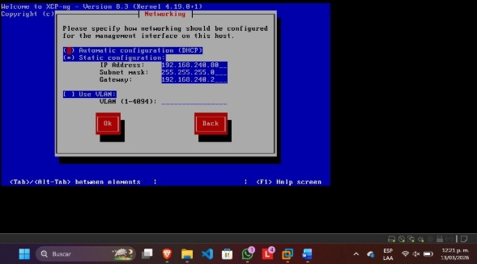
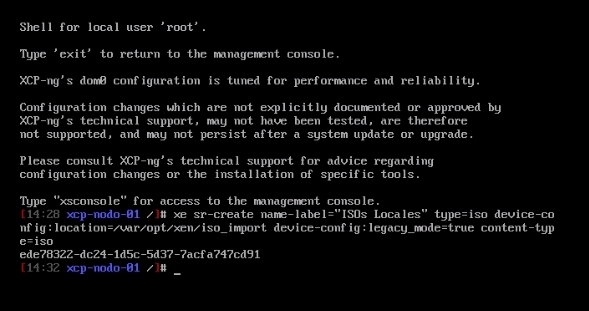
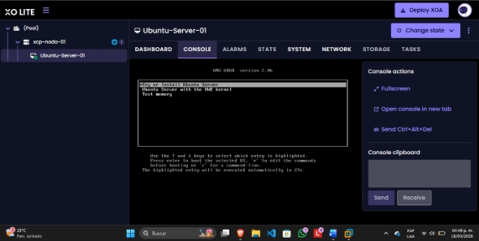

# Arquitectura de Nube Privada (IaaS) de Grado Empresarial: Migración a XCP-ng y Xen Orchestra

**Autor:** Diego Hernández Vázquez  
**Rol:** Estudiante de Ingeniería en Sistemas / Especialista en Ciberseguridad
**Tecnologías:** XCP-ng (Hipervisor Tipo 1), Xen Orchestra (XOA), Paravirtualización (PV/HVM), Administración CLI (`xe`), Virtualización Anidada.

---

## Resumen Ejecutivo y Caso de Negocio

En el panorama actual de la infraestructura TI, la optimización de recursos y los costos de licenciamiento son críticos para la rentabilidad. Tras los recientes cambios en las políticas de licenciamiento de VMware (cobro por core/densidad de RAM), el mantenimiento de clústeres vSphere se ha vuelto insostenible para muchas empresas medianas. 

Este proyecto documenta la evaluación, diseño e implementación de una **Infraestructura como Servicio (IaaS)** basada 100% en tecnologías de código abierto (*Open Source*) de grado empresarial. Se utilizó **XCP-ng** como hipervisor *bare-metal* (nodo de cómputo) y **Xen Orchestra (XOA)** como panel centralizado de orquestación. El objetivo es demostrar la capacidad de reemplazar la funcionalidad de vCenter, garantizando alta disponibilidad y gestión centralizada, eliminando por completo el "vendor lock-in" y los costos asociados al licenciamiento de hardware.

---

## Arquitectura del Centro de Datos

### 1. El Hipervisor (Tipo 1) y el Dom0
A diferencia de los hipervisores Tipo 2 (Hosted), **XCP-ng** es un hipervisor Tipo 1 que se instala directamente sobre el hardware físico, eliminando la sobrecarga del sistema operativo anfitrión. La arquitectura de Xen opera mediante dominios: el **Dom0 (Domain 0)** es el dominio de control privilegiado, un entorno Linux altamente modificado que aloja la API de gestión (XAPI) y tiene acceso directo al hardware (NICs, Controladoras). Este nodo coordina y administra la ejecución de las máquinas virtuales sin privilegios (DomU).

### 2. Aprovisionamiento Óptimo: PV vs. HVM
Para maximizar el rendimiento (I/O) de las máquinas virtuales, se emplean plantillas que definen el método de virtualización:
* **HVM (Hardware Virtual Machine):** Utiliza extensiones del procesador (VT-x) para aislamiento total, emulando el hardware.
* **PV (Paravirtualización):** Modifica el sistema operativo invitado para que se comunique directamente con el hipervisor sin emulación.
El uso de plantillas inyecta la combinación exacta de controladores PV dentro de un entorno HVM (PVHVM), logrando rendimiento de hardware casi nativo.

### 3. Orquestación Desacoplada (Xen Orchestra)
Mientras el hipervisor (XCP-ng) provee la "fuerza bruta", **Xen Orchestra (XOA)** actúa como el cerebro de la nube IaaS. Se despliega como un *appliance* virtual independiente que unifica múltiples servidores (Pools) en una sola vista web, permitiendo aprovisionamiento, respaldos y delegación de permisos.

---

## Fases de Implementación (Virtualización Anidada)

### Fase 1: Aprovisionamiento del Nodo Cómputo (XCP-ng)
Se desplegó el hipervisor mediante virtualización anidada, asignando los recursos de hardware necesarios (10 GB RAM, 100 GB Disco) y configurando una interfaz de gestión con IP estática para garantizar la accesibilidad constante del Dom0.


*Figura 1: Aprovisionamiento de hardware e instalación de la capa base del hipervisor.*


*Figura 2: Configuración de la interfaz de red estática del nodo de administración.*

### Fase 2: Integración de la Capa de Gestión (XOA) y Almacenamiento
Tras inicializar el hipervisor, se vinculó exitosamente el nodo al panel de control de Xen Orchestra. Sin embargo, bajo el esquema anidado, el hipervisor no automatiza la creación del repositorio local de imágenes. Fue necesario interactuar mediante consola para estructurar el almacenamiento base.

```bash
# Creación manual del repositorio de almacenamiento local para imágenes ISO (Storage Repository)
xe sr-create name-label="Local ISO" type=iso device-config:location=/var/opt/xen/iso_import device-config:legacy_mode=true content-type=iso
```


*Figura 3: Ejecución de comandos en la XAPI para aprovisionar el repositorio de almacenamiento (SR).*

### Fase 3: Despliegue de Máquinas Virtuales
Se procedió a cargar el medio de instalación de Ubuntu Server en el nuevo repositorio y se aprovisionaron los recursos de cómputo para el dominio invitado (DomU), validando la conectividad total dentro del orquestador.


*Figura 4: Orquestación y ejecución de la máquina virtual anidada gestionada desde Xen Orchestra.*

---

## Resolución de Incidentes Críticos mediante CLI (Troubleshooting)

Implementar un hipervisor dentro de otro añade capas de complejidad en la abstracción de hardware. Durante el aprovisionamiento de las máquinas virtuales desde la interfaz gráfica de Xen Orchestra, se presentaron fallos estructurales que exigieron **intervención directa a nivel de la API de Xen mediante consola (`xe`)**:

1. **Ausencia de Interfaz de Red Virtual (VIF):**
   * **Diagnóstico:** La máquina virtual base no fue aprovisionada con una tarjeta de red por defecto debido a un fallo en la plantilla gráfica.
   * **Mitigación (CLI):** Se auditó la red física con `xe network-list` y se inyectó un adaptador virtual manualmente vinculándolo a la VM mediante el comando `xe vif-create`.

2. **Redimensionamiento de Almacenamiento en Frío:**
   * **Diagnóstico:** El disco asignado por la plantilla era de 15 GiB, incumpliendo los requerimientos técnicos del despliegue (20 GiB).
   * **Mitigación (CLI):** Se forzó la detención del sistema (`xe vm-shutdown`) y se redimensionó el disco duro virtual en frío ejecutando la instrucción `xe vdi-resize`, ajustando la capacidad lógica de la unidad.

3. **Bucle de Arranque (Boot Loop):**
   * **Diagnóstico:** Tras la instalación, la VM insistía en leer la imagen ISO en lugar del disco duro particionado.
   * **Mitigación (CLI):** Se modificaron las políticas de arranque del hipervisor para ese dominio específico, ajustando el parámetro `HVM-boot-params:order=c` para forzar la lectura prioritaria del disco local (`c`).

---

## Valor de Negocio y Conclusión

Esta implementación demostró que el dominio de la consola de administración (`xe`) es vital para la resiliencia operativa; las interfaces gráficas pueden fallar, pero la CLI siempre permite reconstruir la infraestructura.

Desde una perspectiva financiera y competitiva, la arquitectura **XCP-ng + Xen Orchestra** es una alternativa IaaS definitiva frente al monopolio de VMware. Al ser de código abierto, elimina los costos de licenciamiento por densidad de memoria o *sockets* de procesador, permitiendo un escalamiento de hardware sin penalizaciones económicas. Además, democratiza características de grado *Enterprise* (Alta Disponibilidad, Live Migration, Respaldos Automatizados) que en soluciones propietarias exigen el pago de las licencias más costosas del mercado.

---
**Referencias Bibliográficas:**
* Documentación oficial técnica de Arquitectura XCP-ng y Xen Orchestra.
* Gonzalez, T. *Resize disk on xcp-ng using xen-orchestra and resize lvm*.
* Amazon AWS. *Diferencias entre hipervisores Tipo 1 y Tipo 2*.