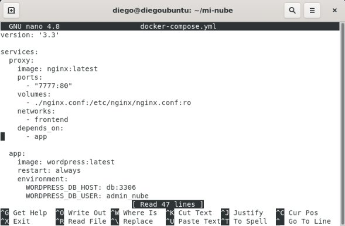
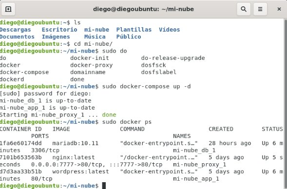
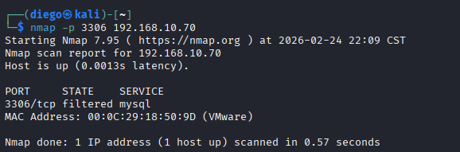

# Implementación de Infraestructura en la Nube (Mini Nube Privada) con Arquitectura de 3 Capas

**Autor:** Diego Hernández Vázquez  
**Rol:** Estudiante de Ingeniería en Sistemas / Especialista en Ciberseguridad 
**Tecnologías:** Docker, Docker Compose, Nginx (Proxy Inverso), WordPress, MariaDB, Ubuntu Server, YAML (IaC).

---

## Resumen Ejecutivo

La adopción de arquitecturas basadas en microservicios y contenedores ha transformado el despliegue de software empresarial. En los modelos IaaS tradicionales, el aprovisionamiento de máquinas virtuales "crudas" exige una enorme inversión de tiempo en la instalación manual de dependencias y configuración de servicios. 

Este proyecto documenta la orquestación de una **Mini Nube Privada** utilizando contenedores de **Docker** e **Infraestructura como Código (IaC)** mediante `docker-compose`. Se desplegó una arquitectura robusta de tres capas (Presentación, Lógica y Persistencia), implementando políticas de seguridad mediante cortafuegos (UFW), aislamiento de redes internas y ocultamiento de topología a través de un Proxy Inverso, demostrando empíricamente que "los servidores son desechables, pero los datos son persistentes".

---

## Arquitectura del Centro de Datos (Modelos de Servicio)

El entorno se estructuró dividiendo las responsabilidades en los tres modelos clásicos de Cloud Computing:

1. **IaaS (Infraestructura como Servicio):** Representada por el servidor base (Ubuntu Server sobre VMware), encargado de la gestión de recursos de hardware, reglas de red y el firewall perimetral (UFW).
2. **PaaS (Plataforma como Servicio):** El motor de Docker actuó como entorno estandarizado. Mediante el archivo YAML, se abstrayeron las dependencias del sistema operativo, permitiendo la ejecución de servicios sin compilar código ni instalar paqueterías (ej. PHP) directamente en el host.
3. **SaaS (Software como Servicio):** El producto final entregado (WordPress). Desde la perspectiva del usuario externo, se consume una aplicación web completamente funcional sin exposición a la complejidad del *backend*.

### Diseño de la Arquitectura de 3 Capas

* **Capa de Presentación (Nginx - Proxy Inverso):** Puerta de entrada de la infraestructura. Recibe peticiones HTTP, actúa como terminador y enruta el tráfico hacia los contenedores internos.
* **Capa de Aplicación (WordPress):** El núcleo lógico. Procesa el código PHP, ejecuta las reglas de negocio y se comunica directamente con la capa de datos.
* **Capa de Datos (MariaDB):** La bóveda de persistencia. Almacena la información de usuarios y contenido en un entorno de red interno (`backend_network`) aislado, sin salida ni exposición a Internet.

---

## Seguridad Perimetral y Gestión de Tráfico

### El Rol Estratégico del Proxy Inverso (Nginx)
A diferencia de un proxy tradicional, el proxy inverso se coloca *delante* de los servidores para proteger la infraestructura interna, aportando dos beneficios críticos:
1. **Ocultamiento de Topología:** WordPress y MariaDB nunca se exponen a Internet. Los escaneos externos solo visualizan a Nginx, impidiendo que el atacante mapee la red interna o identifique el *stack* tecnológico subyacente.
2. **Punto Único de Control:** Permite centralizar la terminación SSL/TLS y establecer políticas unificadas de mitigación contra ataques de Denegación de Servicio (DDoS).

### Mapeo de Puertos (Port Mapping) y Evasión
Los contenedores operan en redes aisladas. Se configuró un mapeo de puertos (`7777:80`) para perforar esta burbuja de manera controlada. 
* Cualquier petición externa al puerto `7777` del host físico (previamente autorizado en UFW) es inyectada ciegamente por Docker al puerto interno `80` del contenedor Nginx.
* **Valor de Seguridad:** Trasladar servicios a puertos no estándar (ej. 7777 en lugar de 80/443) mitiga drásticamente el ruido de fondo y la primera ola de escaneos masivos ejecutados por *botnets* que buscan explotar vulnerabilidades de forma automatizada.

---

## Fases de Despliegue y Orquestación

### Fase 1: Configuración de Infraestructura como Código (IaC)
Se estructuró el archivo `docker-compose.yml` declarando los volúmenes para persistencia, las redes aisladas y el mapeo de puertos personalizado para la capa de presentación.

*Figura 1: Declaración de servicios y configuración del mapeo de puertos (7777:80) en formato YAML.*

### Fase 2: Levantamiento y Verificación de Servicios
El motor de Docker Compose orquestó la descarga, compilación y despliegue de la arquitectura completa en segundos. Se validó el estado de ejecución ininterrumpida de las tres capas.

*Figura 2: Auditoría del estado de los contenedores demostrando las capas activas.*

### Fase 3: Validación de Acceso y Aislamiento Perimetral
Se simuló tráfico desde una red externa (Kali Linux). El acceso a la aplicación web fue exitoso a través del puerto personalizado, mientras que los intentos de conexión directa a la base de datos (puerto 3306) fueron interceptados y rechazados por la arquitectura aislada.

*Figura 3: Consumo de la aplicación (SaaS) a través del puerto 7777.*

*Figura 4: Verificación empírica del aislamiento de red; conexión rechazada al motor MariaDB.*

---

## Resolución de Incidentes y Troubleshooting

Durante el despliegue del entorno, se presentaron y resolvieron incidentes críticos que validan la solidez del diseño:

1. **Colisión de Puertos en el Host (Port Binding Conflict):**
   * **Diagnóstico:** Al intentar levantar Nginx, el motor arrojó el error `port is already allocated`. El puerto 8080 del host estaba secuestrado por un contenedor en desuso (NextCloud) de un laboratorio previo.
   * **Mitigación:** En lugar de apagar el servicio conflictivo, se reescribió la lógica del orquestador (`docker-compose.yml`) para mapear el Proxy Inverso hacia un puerto totalmente nuevo (`7777:80`), demostrando la flexibilidad de la plataforma.

2. **Vulnerabilidad por Divulgación de Información (Information Disclosure):**
   * **Diagnóstico:** Al auditar las cabeceras HTTP mediante `curl -v`, el servidor revelaba las versiones exactas del *stack* tecnológico (`nginx/1.29.5` y `PHP/8.3.30`), representando un vector crítico para ataques dirigidos.
   * **Mitigación:** Se aplicaron políticas de "Seguridad por Oscuridad". Se inyectaron las directivas `server_tokens off;` y `proxy_hide_header` directamente en la configuración interna de Nginx, ocultando las firmas del software y blindando el servidor ante escáneres de vulnerabilidades automatizados.

---

## Análisis de Escalabilidad (Balanceo de Carga)

El diseño de esta arquitectura prepara la infraestructura para una elasticidad real. Si se ejecutara un comando de escalado horizontal en Docker para replicar múltiples instancias del contenedor de WordPress, **Nginx transicionaría automáticamente de ser un simple enrutador a un Balanceador de Carga**. 

Aprovechando el servidor DNS interno de Docker, Nginx distribuiría las peticiones entrantes mediante un algoritmo **Round-Robin** (por turnos) entre las distintas réplicas de la aplicación, incrementando exponencialmente la tolerancia a fallos y la capacidad de concurrencia del sitio.

---

## Conclusión
Este despliegue evidenció la superioridad operativa de Docker Compose frente a la administración monolítica tradicional. La capacidad de replicar un entorno multinivel de alta disponibilidad únicamente declarando "qué se necesita" en un archivo YAML abstrae la complejidad del hardware. La lección arquitectónica más valiosa fue comprobar la inmutabilidad de la nube: la destrucción intencional de un contenedor no afecta la operatividad a largo plazo, ya que el sistema se recupera intacto gracias a la correcta parametrización de los volúmenes de almacenamiento persistente.

---
**Referencias Bibliográficas:**
* *Docker Compose*. Documentación oficial, Docker Inc.
* *NGINX reverse proxy*. Documentación de administración, Nginx.