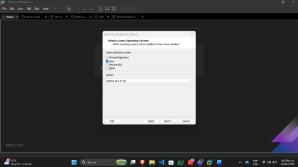
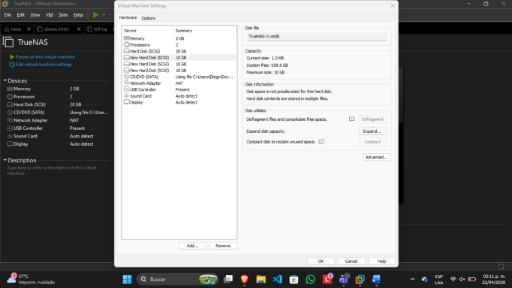
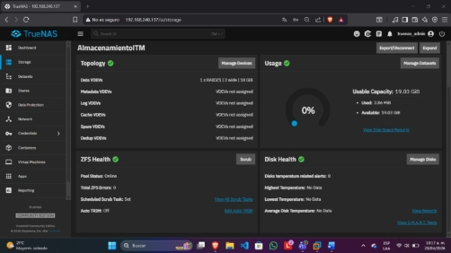
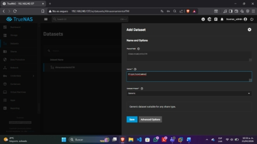
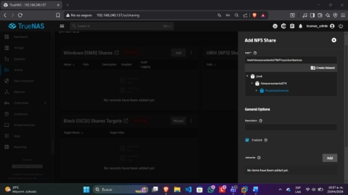
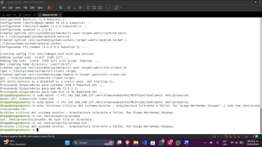
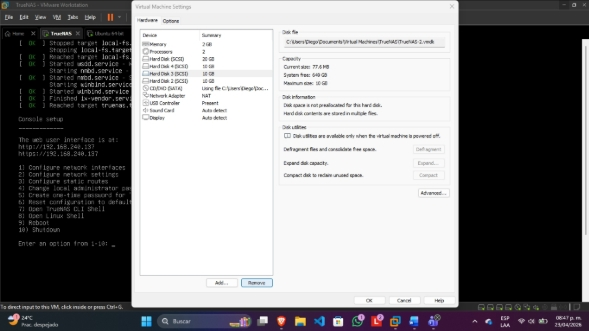
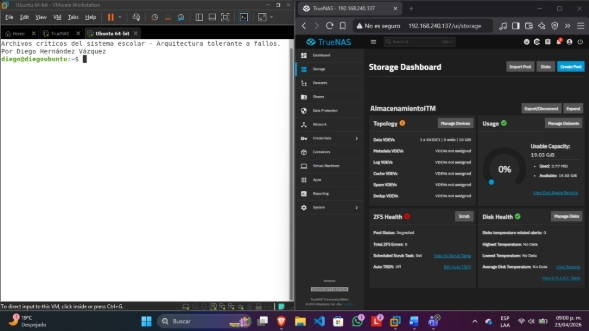

# Implementación de Arquitectura NAS de Alta Disponibilidad con TrueNAS y ZFS (RAID-Z1)

**Autor:** Diego Hernández Vázquez  
**Rol:** Estudiante en Ingeniería de Sistemas / Especialista en Ciberseguridad
**Tecnologías:** TrueNAS Core/SCALE, ZFS, RAID-Z1, NFS, Ubuntu Server, VMware, Arquitectura Desacoplada.

---

## Resumen Ejecutivo

En la arquitectura de centros de datos moderna, la gestión del almacenamiento ha evolucionado de modelos locales rígidos (DAS) hacia soluciones centralizadas y resilientes. Un sistema **NAS (Network Attached Storage)** permite centralizar la administración de los datos, facilitando la escalabilidad y la implementación de políticas de seguridad robustas a través de la red.

El núcleo tecnológico de esta arquitectura recae en el sistema de archivos **ZFS (Zettabyte File System)**. A diferencia de los sistemas tradicionales, ZFS integra el gestor de volúmenes y el sistema de archivos en una sola capa, permitiendo la protección contra la corrupción silenciosa de datos y la creación de arreglos redundantes por software. 

Para este despliegue se utilizó un arreglo **RAID-Z1**, optimizado para tolerar el fallo catastrófico de un disco físico. La lógica de reconstrucción se basa en la operación OR exclusivo (XOR). Al escribir datos ($D$) en un *pool* de $n$ discos, el sistema calcula un bloque de paridad ($P$) cumpliendo la ecuación: 
$D_1 \oplus D_2 \oplus \dots \oplus D_{n-1} = P$
En estado degradado, ZFS reconstruye la información faltante en tiempo real aplicando esta misma operación lógica sobre los bloques sobrevivientes.

### Ventajas del Desacoplamiento de Datos
1. **Escalabilidad Independiente:** Crecimiento de almacenamiento sin alterar los nodos de cómputo.
2. **Alta Disponibilidad (HA):** El fallo del sistema operativo del servidor de aplicaciones no compromete la persistencia de la información.
3. **Gestión Centralizada:** Facilita políticas de Snapshots y replicación desde un solo punto de control.

---

## Alcance del Proyecto

* **Aprovisionamiento de Hardware:** Configurar un nodo de almacenamiento (TrueNAS) con tres discos en crudo dedicados al arreglo ZFS, y un nodo de cómputo cliente (Ubuntu Server).
* **Configuración de Tolerancia a Fallos:** Construir un Pool ZFS en nivel RAID-Z1 para garantizar redundancia de paridad distribuida.
* **Exposición de Servicios:** Desplegar un recurso compartido mediante el protocolo estándar **NFS**.
* **Integración de Cómputo:** Montar remotamente el Dataset en el sistema de archivos del cliente Linux.
* **Ingeniería del Caos (Disaster Recovery):** Simular una falla catastrófica de hardware (desconexión en caliente) para auditar el estado `DEGRADED` del Pool y verificar la integridad ininterrumpida de los datos.

---

## Arquitectura y Metodología de Implementación

### Fase A: Aprovisionamiento de Infraestructura
Para cumplir con el principio de desacoplamiento, se desplegaron dos entidades virtuales independientes:
1. **Nodo de Almacenamiento (TrueNAS):** Aprovisionado con su disco de arranque y **3 discos virtuales adicionales en crudo** (10 GB c/u) para simular la cabina física.
2. **Nodo de Cómputo (Ubuntu Server):** Aprovisionado con un único disco de sistema operativo para simular un servidor de aplicaciones web.


*Figura 1: Aprovisionamiento base del Appliance TrueNAS.*


*Figura 2: Inyección de 3 unidades lógicas adicionales para el arreglo de paridad.*

### Fase B: Construcción de Redundancia y Compartición (NFS)
Desde el panel de administración de TrueNAS, se integraron los 3 discos en un único **Storage Pool** bajo la topología **RAID-Z1**. 


*Figura 3: Creación y configuración del Pool de almacenamiento con redundancia simple.*

Posteriormente, se generó un **Dataset** dedicado (sistema de archivos jerárquico dentro de ZFS) y se expuso a la red de área local habilitando y configurando el servicio **NFS** (*Network File System*).


*Figura 4: Aislamiento lógico de los datos mediante un Dataset.*


*Figura 5: Levantamiento y vinculación del servicio NFS al Dataset.*

### Fase C: Integración de Cómputo y Montaje Remoto
En el servidor de aplicaciones (Ubuntu Server), se instalaron las dependencias de red necesarias y se realizó el montaje explícito del volumen exportado por la cabina NAS.

```bash
# Actualización e instalación del cliente NFS
sudo apt update && sudo apt install nfs-common -y

# Montaje de la red de almacenamiento en el directorio local
sudo mount -t nfs 192.168.240.137:/mnt/AlmacenamientoITM/ProyectosAlumnos /mnt/proyectos

# Validación de escritura directa en la NAS
echo "Archivos críticos del sistema - Arquitectura tolerante a fallos por Diego" | sudo tee /mnt/proyectos/prueba.txt
cat /mnt/proyectos/prueba.txt
```


*Figura 6: Enlace de red exitoso y verificación de persistencia remota de datos.*

### Fase D. Simulación de Desastre y Resiliencia
Para comprobar la promesa de Alta Disponibilidad del arreglo RAID-Z1, se indujo una falla de hardware desconectando ("Hot-plug removal") uno de los discos físicos de la cabina TrueNAS en pleno funcionamiento.


*Figura 7: Simulación de desastre eliminando el disco físico secundario.*

**Respuesta del Sistema (TrueNAS):**
El demonio de ZFS detectó inmediatamente la pérdida de la unidad. El estado del Pool transicionó de ONLINE a DEGRADED. El sistema alertó sobre la falla, pero continuó operando utilizando los bloques de paridad en los dos discos sobrevivientes.


*Figura 8: Panel de Storage reportando el estado DEGRADED del arreglo ZFS.*

**Respuesta del Cliente (Ubuntu Server):**
Desde el servidor de aplicaciones se ejecutó nuevamente la lectura del archivo crítico. El acceso a los datos se mantuvo 100% íntegro e ininterrumpido, validando la resiliencia del diseño arquitectónico.


*Figura 9: Lectura exitosa del recurso de red durante el estado de emergencia de la cabina.*

## Análisis
**1. Capacidad Neta vs. Capacidad Bruta**
* Al aprovisionar 3 discos físicos de 10 GB (30 GB brutos) en RAID-Z1, el espacio real utilizable reportado por TrueNAS fue de 19.03 GiB.
* **Justificación:** La topología RAID-Z1 requiere "sacrificar" el equivalente a la capacidad de un disco completo exclusivamente para almacenar los bloques lógicos de paridad distribuida, más un margen de overhead para los metadatos transaccionales de ZFS.

**2. Límite de Tolerancia a Fallos**
* **Escenario:** Si el sistema se encuentra en estado DEGRADED y falla un segundo disco antes de poder reconstruir el arreglo (Resilvering).
* **Impacto:** Pérdida catastrófica e irrecuperable de la información. RAID-Z1 está matemáticamente diseñado para tolerar la pérdida de exactamente un (1) disco. Un segundo fallo rompería la ecuación lógica de ZFS, transicionando el pool a estado FAULTED de forma permanente.

## Resolución de Incidentes Críticos (Troubleshooting)
Más allá de la correcta implementación del almacenamiento, el despliegue exigió la superación de incidentes de infraestructura a nivel de sistema operativo y red en el nodo cliente:

* **Fallos de Resolución y Acceso a Repositorios (Errores 403 / 404):** Durante el intento de instalación de la paquetería nfs-common, el gestor apt reportó conexiones rechazadas o rutas no encontradas.

    * **Diagnóstico:** Los bloqueos de red perimetrales en el laboratorio físico limitaban el acceso a los repositorios por defecto de Ubuntu, sumado a una posible corrupción en la caché de DNS del sistema guest.

    * **Mitigación:** Se forzó una reescritura manual del archivo de resolución de nombres (/etc/resolv.conf) para apuntar a servidores DNS públicos robustos y se debió evadir el bloqueo de hardware ajustando la topología de red virtual, demostrando la necesidad de dominar el diagnóstico de conectividad (Capa 3 y 4) antes de integrar servicios de almacenamiento.

## Conclusión
El laboratorio cumplió el objetivo técnico de abstraer y proteger la capa de datos. Sin embargo, demostró que en el campo de la infraestructura Cloud, la configuración de la herramienta (TrueNAS) es solo el último paso. La verdadera habilidad del Ingeniero recae en diagnosticar bloqueos de red perimetrales, entender las dependencias del sistema operativo y comprender la lógica matemática detrás de las decisiones de almacenamiento para garantizar la Continuidad del Negocio.

## Referencias Bibliográficas:
* Bryan, D. (2024). Cómo empezar con TrueNAS Scale. StorageReview.
* Documentación oficial técnica sobre resolución DNS en sistemas Linux nativos.