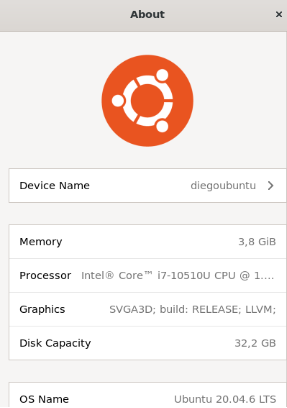
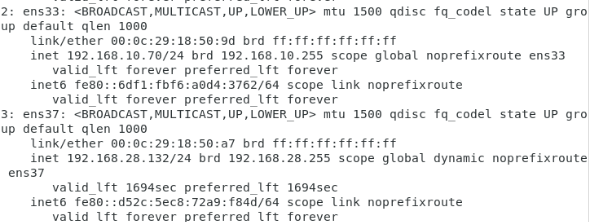
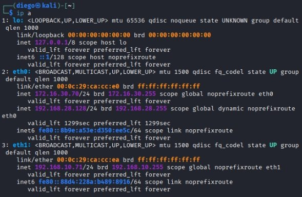
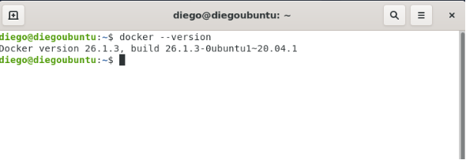
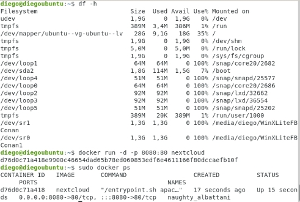
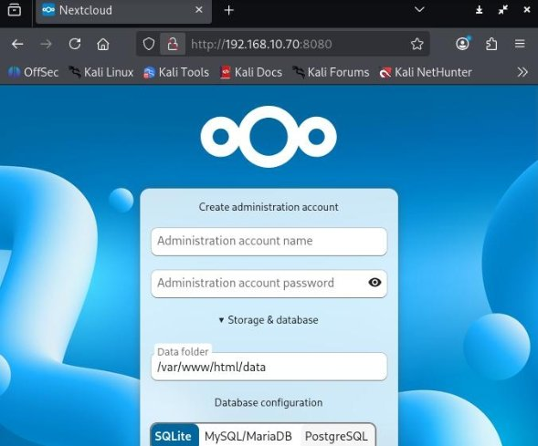
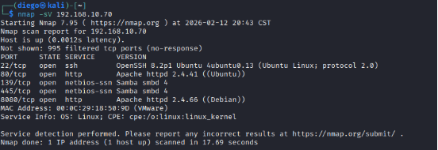
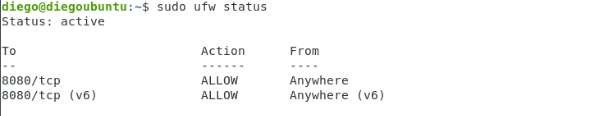
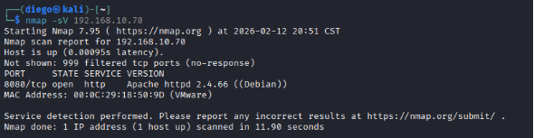

# Despliegue y Hardening de Nube Privada (IaaS/PaaS/SaaS) para Almacenamiento Corporativo

**Autor:** Diego Hernández Vázquez  
**Rol:** Estudiante de Ingeniería en Sistemas / Especialista en Ciberseguridad
**Tecnologías:** Ubuntu Server, VMware, Docker, Nextcloud, UFW (Firewall), Nmap, Kali Linux.

---

## Resumen Ejecutivo y Caso de Negocio
La startup "Secure Cloud Solutions" requería una infraestructura de almacenamiento privado en la nube que garantizara la soberanía de sus datos corporativos, manteniendo un control absoluto sobre la plataforma y la red subyacente.

Este proyecto documenta la arquitectura, despliegue y aseguramiento de una Nube Privada implementando de manera práctica el **Modelo de Responsabilidad Compartida**. Se orquestaron las tres capas de servicio de la nube (IaaS, PaaS y SaaS) desde cero, culminando con una auditoría de seguridad y el endurecimiento (*hardening*) del perímetro de red para mitigar proactivamente vectores de ataque.

---

## Arquitectura de la Nube (Capas de Servicio)

### 1. Capa de Infraestructura (IaaS)
Se desplegó el servidor base (Ubuntu Server) sobre el hipervisor VMware. Para garantizar la estabilidad del servicio y soportar la interfaz gráfica de administración (GUI), se realizó un aprovisionamiento ajustado de recursos con **4 GB de RAM y 2 vCPUs** (superando el estándar de 2 GB).


*Figura 1: Aprovisionamiento de recursos de cómputo para el nodo IaaS.*

**Segmentación de Red:** Para aislar el entorno de producción y permitir pruebas de intrusión controladas, se configuró una red privada en modo "LAN Segment/Custom", homologando la topología con el nodo ofensivo (Kali Linux).


*Figura 2: Verificación de direccionamiento IP en la interfaz del servidor Ubuntu.*


*Figura 3: Verificación de direccionamiento IP en el nodo atacante aislado.*

### 2. Capa de Plataforma (PaaS) y Software (SaaS)
Para la capa de plataforma, se instaló el motor de **Docker**, abstrayendo las dependencias del sistema operativo y estandarizando el entorno de ejecución.


*Figura 4: Despliegue del motor de contenedores (PaaS).*

Sobre esta plataforma, se instanció el servicio de **Nextcloud** como solución final de Software como Servicio (SaaS), proporcionando la interfaz de almacenamiento y colaboración en la nube lista para el usuario final.


*Figura 5: Instanciación del contenedor de Nextcloud.*


*Figura 6: Panel de administración SaaS listo para producción.*

---

## Auditoría de Seguridad y Endurecimiento (Hardening)

Una vez operativa la nube, se procedió a asegurar el perímetro aplicando el principio de **Privilegio Mínimo** a nivel de red.

### Fase 1: Reconocimiento Ofensivo
Se utilizó `Nmap` desde la máquina atacante (Kali Linux) para mapear la superficie de exposición del servidor Ubuntu, identificando los puertos y servicios abiertos por defecto en el sistema operativo.


*Figura 7: Escaneo inicial de superficie de ataque.*

### Fase 2: Configuración de Firewall (UFW)
Se implementó una política estricta de **"Denegar por Defecto" (Default Deny)** utilizando *Uncomplicated Firewall* (UFW). Se cerraron proactivamente todos los puertos de administración y servicios de red (22, 80, 139, 445), creando una regla exclusiva para permitir únicamente el tráfico hacia el puerto de la aplicación en la nube.

```bash
# Permiso exclusivo para el servicio SaaS y activación del escudo perimetral
sudo ufw allow 8080
sudo ufw enable
```


*Figura 8 y 9: Inyección de reglas y activación del Firewall perimetral.*

### Fase 3: Validación de Mitigación
Un escaneo de validación final confirmó el éxito del *hardening*. La superficie de ataque se redujo drásticamente; el escáner demostró que todos los puertos del sistema operativo estaban filtrados y bloqueados, dejando únicamente el puerto `8080` (Nextcloud) accesible de forma intencional para los usuarios legítimos.


*Figura 10: Validación del cierre de brechas; superficie de ataque mitigada.*

---

## Resolución de Incidentes de Red (Troubleshooting)

Durante la fase de despliegue y segmentación IaaS, se presentaron conflictos de enrutamiento y capa física virtual que exigieron diagnósticos estructurales:

1. **Pérdida de Conectividad en el Segmento Privado (Host Unreachable):**
   * **Diagnóstico:** Las trazas ICMP entre Kali y Ubuntu fallaban. Al auditar los adaptadores en VMware, se detectó una discrepancia en los switches virtuales: Kali operaba en un segmento (`VMnet19`), mientras Ubuntu estaba en un adaptador NAT estándar.
   * **Mitigación:** Se homologó la topología física-virtual asignando tanto la interfaz `eth1` (Kali) como `ens33` (Ubuntu) al mismo segmento de red lógico: `"Custom (LAN)"`.

2. **Inversión Lógico-Física de Interfaces de Red:**
   * **Diagnóstico:** El servidor Ubuntu carecía de salida a Internet. La interfaz secundaria (`ens37`), destinada a recibir configuración DHCP vía NAT, no obtenía IP; simultáneamente, la interfaz estática privada (`ens33`) estaba erróneamente inyectada en el segmento NAT.
   * **Mitigación:** Se realizó un remapeo de los adaptadores de red en el hipervisor:
     * *Network Adapter 1:* Reconfigurado hacia `"Custom (LAN)"` para el tráfico interno.
     * *Network Adapter 2:* Reconfigurado hacia `"NAT"` para la salida a Internet.
   * **Resultado:** Conectividad LAN restablecida entre el nodo ofensivo y el servidor, recuperando además el acceso a los repositorios externos para la descarga de Docker.

## Conclusión y Valor de Negocio

La implementación de esta infraestructura demostró de manera práctica la aplicación del **Modelo de Responsabilidad Compartida** en entornos Cloud. Mientras que la abstracción de las capas PaaS y SaaS (Docker y Nextcloud) acelera drásticamente el despliegue de soluciones corporativas, el control y la seguridad de la capa subyacente (IaaS) sigue siendo una responsabilidad crítica e indelegable.

El endurecimiento (*hardening*) del perímetro mediante políticas de "Denegación por Defecto" (Default Deny) comprobó que una nube privada solo es viable si se diseña bajo el principio de **Seguridad desde el Diseño (Security by Design)**. Asimismo, la resolución de incidentes de enrutamiento físico-virtual durante el despliegue reafirmó que el dominio absoluto de la capa de red es el cimiento indispensable para que cualquier arquitectura en la nube opere de forma resiliente, aislada y verdaderamente segura frente a amenazas externas.