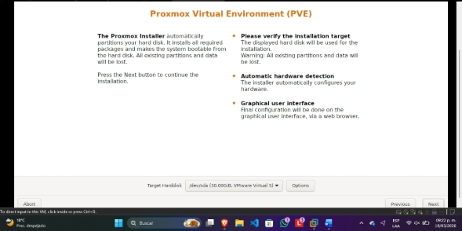
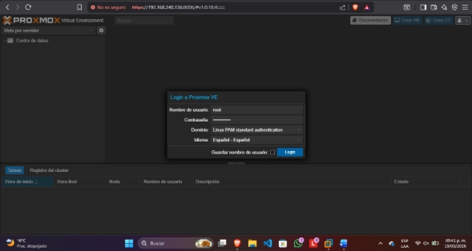
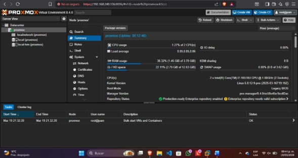
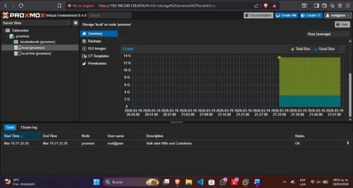
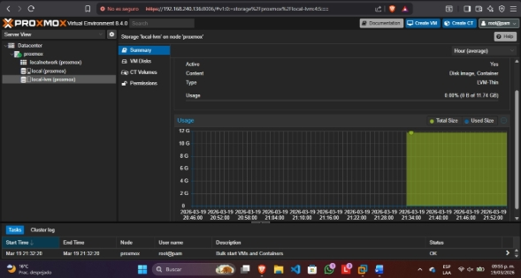

# Despliegue y Arquitectura de Virtualización "All-in-One" con Proxmox VE

**Autor:** Diego Hernández Vázquez  
**Rol:** Estudiante de Ingeniería de Sistemas / Especialista en Ciberseguridad.
**Tecnologías:** Proxmox VE, KVM, LVM-Thin, Debian GNU/Linux, Arquitectura ROBO.

---

## Resumen Ejecutivo

En el diseño de infraestructura, las sucursales remotas u oficinas pequeñas (conocidas en la industria como **ROBO** - *Remote Office / Branch Office*) representan un desafío técnico y financiero particular. A menudo, estas ubicaciones requieren virtualizar servicios locales críticos (como controladores de dominio o servidores de archivos), pero carecen del presupuesto para licenciamiento propietario y no cuentan con el hardware robusto para soportar arquitecturas de gestión descentralizadas.

Este proyecto documenta la implementación de **Proxmox Virtual Environment (VE)** como solución estratégica. Proxmox VE es un hipervisor *bare-metal* (Tipo 1) de código abierto que opera bajo un modelo "Todo en Uno" (*All-in-One*). Al integrar tanto el motor de virtualización como la interfaz web de orquestación directamente en el mismo nodo físico, se elimina la necesidad de desplegar máquinas virtuales adicionales exclusivas para administración, optimizando drásticamente la memoria RAM y simplificando la curva operativa.

---

## Marco Teórico y Arquitectónico

### 1. KVM (Kernel-based Virtual Machine) y Base Debian
Proxmox VE no es un sistema operativo creado desde cero; está construido sobre **Debian GNU/Linux**. Hereda la estabilidad del ecosistema Debian y utiliza **KVM**, un módulo integrado en el kernel de Linux que convierte al sistema en un hipervisor Tipo 1. Esto permite que las máquinas virtuales interactúen directamente con las extensiones de virtualización del procesador físico (Intel VT-x / AMD-V), logrando un rendimiento casi nativo.

### 2. Arquitectura "All-in-One" vs. XCP-ng
A diferencia de hipervisores como XCP-ng —que requieren forzosamente compilar un servidor externo (Xen Orchestra) para orquestar la infraestructura— Proxmox trae el servidor web de administración integrado nativamente. Esta diferencia arquitectónica lo hace superior para entornos ROBO donde cada megabyte de RAM es vital.

### 3. Aprovisionamiento Ligero (Thin Provisioning) mediante LVM
Proxmox utiliza **LVM (Logical Volume Manager)** para abstraer el almacenamiento físico. A través de su variante `LVM-Thin`, permite el aprovisionamiento ligero: un disco virtual de 30 GiB para una máquina virtual solo ocupará espacio real en el servidor a medida que se escriban bloques de datos, ahorrando capacidad física.

---

## Fases de Implementación y Auditoría

### Fase 1: Aprovisionamiento del Nodo Hypervisor
Se configuró el entorno *bare-metal* habilitando las extensiones de virtualización por hardware (VT-x) y asignando recursos base para el hipervisor. Durante la instalación sobre la distribución Debian, se establecieron políticas de red con IP estática y credenciales seguras para el usuario `root`.

*Figura 1: Aprovisionamiento de red e instalación de Proxmox VE.*

### Fase 2: Auditoría de Seguridad y Dashboard (Puerto 8006)
El acceso al hipervisor se realiza especificando explícitamente el protocolo **HTTPS** y el puerto **8006**. Esto no es una configuración arbitraria, sino una medida estricta de Seguridad en la Nube:
* **Mitigación de MitM:** El orquestador tiene control absoluto sobre el centro de datos. Forzar HTTPS asegura que toda la comunicación (desde el login hasta las consolas VNC de las VMs) viaje cifrada mediante TLS/SSL, evitando ataques de *Man-in-the-Middle* en la red local.

*Figura 2: Autenticación cifrada en el orquestador web integrado.*

### Fase 3: Análisis de Consumo y Tipos de Almacenamiento
En la vista general (*Summary*), se auditó el consumo del nodo (Dom0). Al ser un entorno integrado, Proxmox destina una pequeña porción de RAM para mantener la interfaz web y el OS subyacente, dejando el resto liberado para las VMs.

*Figura 3: Monitoreo en tiempo real del hipervisor físico.*

Se auditaron y diferenciaron arquitectónicamente los dos repositorios de almacenamiento creados por defecto:
1. **`local` (File-based Storage):** Partición basada en directorios estructurada para guardar archivos estáticos vitales, como imágenes ISO, plantillas de contenedores (LXC) y archivos de respaldo de seguridad.
2. **`local-lvm` (Block-based Storage):** Almacenamiento a nivel de bloques nativo. Su propósito exclusivo es alojar los discos duros virtuales (VM Disks) aprovechando la tecnología `LVM-Thin` para el aprovisionamiento ligero.

*Figura 4: Repositorio basado en archivos (ISOs y Backups).*

*Figura 5: Repositorio a nivel de bloques (Discos Virtuales).*

### Fase 4: Flujo de Despliegue de Máquinas Virtuales
Se validó el flujo de trabajo operativo para el aprovisionamiento de un servidor de aplicaciones (Ubuntu Server):
1. **Carga de ISO:** Subida del medio de instalación al repositorio `local`.
2. **Asignación de Cómputo:** Configuración de vCPUs y memoria RAM en el asistente `Create VM`.
3. **Mapeo de Almacenamiento:** Asignación de un disco de 25 GiB apuntando obligatoriamente al repositorio `local-lvm`.
4. **Interacción:** Encendido e interacción directa a través de la consola VNC del dashboard.

---

## Conclusión Estratégica

Desde una perspectiva de ingeniería y despliegue rápido, Proxmox VE demostró una superioridad técnica operativa frente a soluciones descentralizadas como Xen Orchestra para el caso de uso planteado. 

La capacidad de entregar un orquestador completamente funcional desde el primer reinicio del hipervisor, sumado a la gestión inteligente del almacenamiento mediante `LVM-Thin` y la robustez del kernel KVM/Debian, lo convierten en la arquitectura ideal para sucursales ROBO. Permite a las organizaciones democratizar la virtualización empresarial y mantener altos estándares de seguridad (TLS/SSL) sin incurrir en costos de licenciamiento prohibitivos o infraestructuras físicas sobredimensionadas.

---
**Referencias Bibliográficas:**
* ISN. (2024). *Guía de Proxmox VE: Instalación y Creación de Máquinas virtuales*.
* Morrison, R. (2024). *Proxmox vs XCP-ng: Hypervisors comparison*. Bacula Systems.