# Implementación de una Red de Área de Almacenamiento (SAN) Ligera mediante iSCSI para Entornos de Virtualización

**Autor:** Diego Hernández Vázquez  
**Rol:** Estudiante en Ingenieria de Sistemas / Especialista en Ciberseguridad 
**Tecnologías:** Ubuntu Server, targetcli-fb, Windows iSCSI Initiator, NTFS, VMware Workstation, Protocolo iSCSI (Capa de Bloques).

---

## Resumen Ejecutivo

En el diseño de centros de datos modernos, el almacenamiento de información se clasifica según su método de conexión y acceso. Comprender estas diferencias es fundamental para seleccionar la arquitectura adecuada:

* **DAS (Direct-Attached Storage):** Almacenamiento conectado físicamente a la placa base del servidor (ej. un disco SATA/NVMe interno). Carece de capacidades de compartición nativa por red y genera silos de información.
* **NAS (Network Attached Storage):** Solución que comparte datos a nivel de archivos a través de la red mediante protocolos como NFS o SMB. El sistema operativo cliente lo monta y visualiza como una carpeta compartida.
* **SAN (Storage Area Network):** Arquitectura de red de alta velocidad que comparte almacenamiento a nivel de bloques. El sistema operativo cliente reconoce el recurso compartido a través de la red como un disco duro físico virgen (un-formatted raw disk), lo que le permite inicializarlo, particionarlo y formatearlo con su propio sistema de archivos nativo (ej. NTFS, ext4).

Para este proyecto, se implementó una SAN ligera utilizando el protocolo **iSCSI** (*Internet Small Computer Systems Interface*), el cual encapsula comandos SCSI sobre redes TCP/IP. La arquitectura se compone de:
1.  **Target:** El servidor dedicado que aprovisiona, administra y exporta el almacenamiento en la red (Ubuntu Server).
2.  **Initiator:** El cliente de cómputo que consume los bloques de almacenamiento (Windows Host).
3.  **LUN (Logical Unit Number):** La delimitación o porción lógica del disco crudo que el Target presenta al Initiator.

---

## Alcance del Proyecto

* **Aprovisionamiento de la Cabina SAN (Target):** Configurar un backend de almacenamiento crudo en una máquina virtual Linux optimizada y exponerlo a la red mediante la suite `targetcli`.
* **Consumo de Bloques en el Cliente (Initiator):** Establecer el enlace de red de capa de bloques utilizando el Iniciador iSCSI nativo de Windows para montar el volumen remoto como un dispositivo local.
* **Preparación de Volúmenes Lógicos:** Inicializar y formatear el almacenamiento virtualizado empleando el sistema de archivos NTFS.
* **Despliegue Desacoplado de Cómputo:** Configurar una máquina virtual de prueba en el hipervisor (VMware Workstation), forzando el aprovisionamiento de sus componentes base y discos virtuales (`.vmdk`) directamente sobre la LUN de red.
* **Validación de Resiliencia y Alta Disponibilidad (HA):** Analizar el comportamiento de la infraestructura ante contingencias físicas en los nodos de procesamiento.

---

## Arquitectura y Metodología de Implementación

### Fase A: Configuración de la Cabina SAN Ligera (Target)
Se desplegó una instancia virtual de Ubuntu Server con recursos optimizados (1 GB RAM), equipada con un volumen secundario en crudo de 10 GB dedicado exclusivamente a actuar como el Backstore de nuestra SAN.

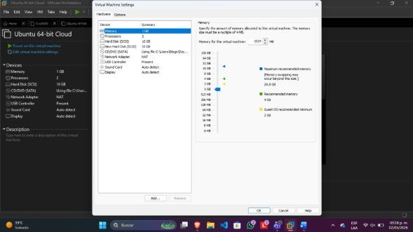
*Figura 1: Aprovisionamiento de hardware virtual para el Target.*

Se utilizó la herramienta especializada `targetcli-fb` para realizar la abstracción del disco físico a un dispositivo lógico de bloques administrable por iSCSI.

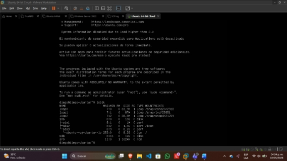
*Figura 2: Identificación del volumen lógico secundario en el sistema operativo.*

```bash
# Actualización del repositorio e instalación del framework de administración iSCSI
sudo apt update && sudo apt install targetcli-fb -y
```
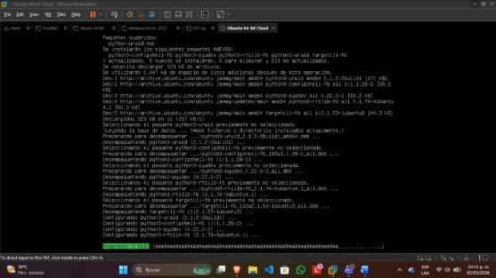
*Figura 3: Despliegue de la paquetería de la cabina iSCSI.*

Una vez dentro de la CLI interactiva de targetcli, se procedió a:

Definir el objeto de almacenamiento de bloques (backstores/block).

Crear el IQN (iSCSI Qualified Name) único para el Target.

Asociar y mapear la LUN correspondiente.

Deshabilitar de forma controlada los atributos de ACL (Access Control Lists) y autenticación estricta para simplificar la interconexión en el laboratorio.

**Estructura de comandos ejecutados en el shell de targetcli**
```text
/backstores/block create name=san_backstore_disk dev=/dev/sdb
/iscsi create iqn.2026-05.local.storage:target01
/iscsi/iqn.2026-05.local.storage:target01/tpg1/luns create /backstores/block/san_backstore_disk
/iscsi/iqn.2026-05.local.storage:target01/tpg1/portals create 0.0.0.0 3260
/iscsi/iqn.2026-05.local.storage:target01/tpg1 set attribute authentication=0 demo_mode_write_protect=0 generate_node_acls=1 cache_dynamic_acls=1
```

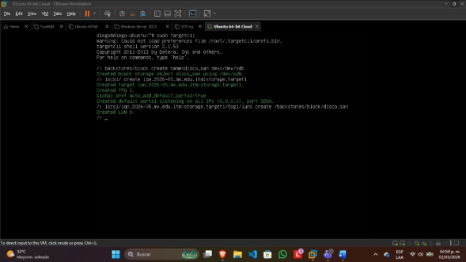
*Figura 4: Orquestación del backend, IQN, LUN y Portales de escucha.*

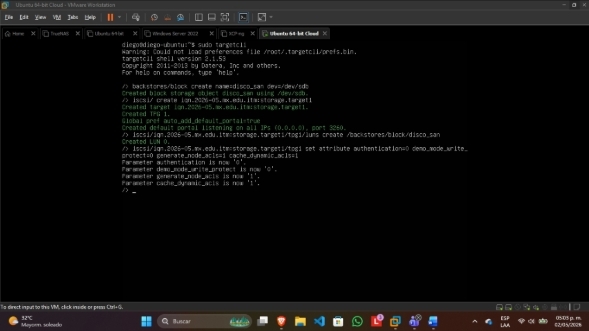
*Figura 5: Ajuste de atributos globales de autenticación.*

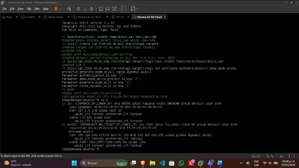
*Figura 6. Persistencia de la configuración de almacenamiento y lectura de la interfaz IP del Target.*

### Fase B: Interconexión desde el Hipervisor Físico (Initiator)
Desde el sistema operativo anfitrión (Windows), se inicializó el motor de servicios del Iniciador iSCSI para apuntar directamente hacia la dirección IP del Portal de la cabina SAN Ligera (puerto por defecto TCP 3260).

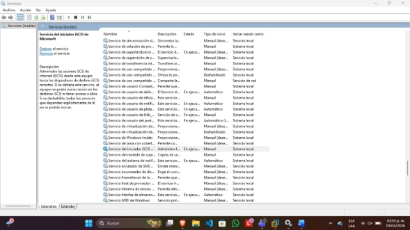
*Figura 7. Inicialización del servicio del Iniciador iSCSI en el Host*

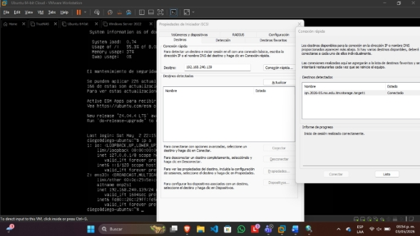
*Figura 8. Descubrimiento y conexión exitosa al IQN expuesto por el Target.*

Al completarse el enlace de red, el Administrador de Discos de Windows detectó inmediatamente una nueva unidad física de 10 GB en estado "No inicializado". Esto demuestra empíricamente que el almacenamiento se transfirió a nivel de bloques puros y no de archivos compartidos.

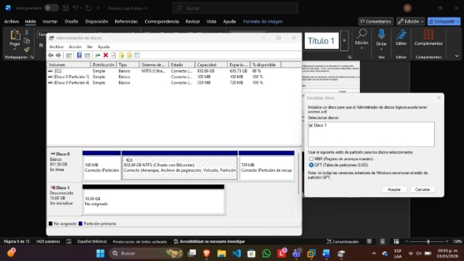
*Figura 9. Detección e inicialización del volumen de red en el Host.*

El volumen fue montado y particionado bajo el esquema GPT, formateándose con el sistema de archivos corporativo NTFS y asignándole la letra de unidad local Z:.

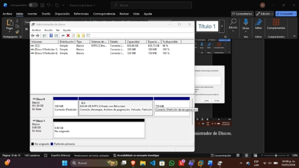
*Figura 10. Estado activo del almacenamiento remoto en la persistencia del sistema.*

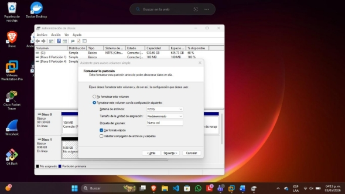
*Figura 11. Asignación de tamaño y sector de asignación del nuevo volumen.*

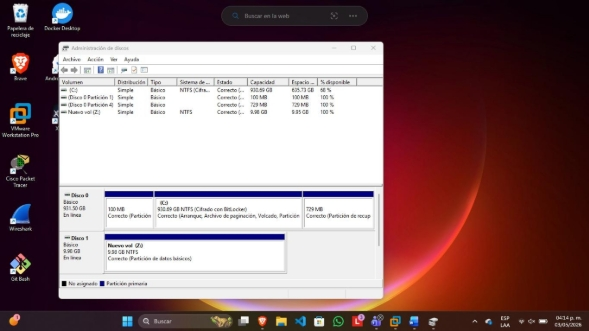
*Figura 12. Unidad de almacenamiento Z: lista para el consumo de aplicaciones de alta demanda.*

### Fase C: Consumo del Almacenamiento Desacoplado en el Hipervisor
Con el volumen de red Z: operando transparentemente en el sistema operativo, se procedió a abrir el hipervisor VMware Workstation. Se configuró una nueva máquina virtual forzando explícitamente que la ruta de sus archivos de configuración (.vmx) y discos virtuales (.vmdk) se alojara dentro de la SAN de red en lugar del almacenamiento local SSD (C:).

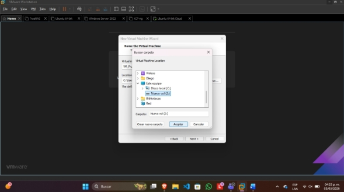
*Figura 13. Despliegue de la VM mapeada sobre la unidad Z: de la SAN.*

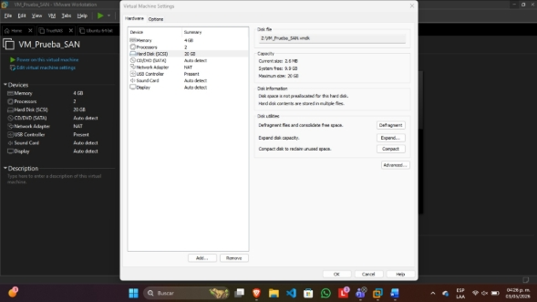
*Figura 14. Verificación del correcto almacenamiento y ejecución de los ficheros de la VM sobre la red de bloques.*

## Diagnóstico y Resolución de Incidentes (Troubleshooting)
Durante el ciclo de vida del despliegue, se aislaron y resolvieron con éxito retos críticos de infraestructura:

* **Bloqueo del Iniciador iSCSI en Cliente Windows:** Durante la conexión inicial, el panel de configuración reportaba fallas intermitentes de enlace.

    * **Diagnóstico:** El servicio del iniciador iSCSI nativo no se encontraba en ejecución automática, impidiendo la comunicación con la pila de red TCP/IP.

    * **Mitigación:** Se accedió a la consola avanzada de servicios de Windows (services.msc), forzando el inicio manual y configurando el arranque en modo automático para asegurar la persistencia del volumen tras reinicios del Host.

* **Inestabilidad en Entornos Volátiles basados en RAM:** Al reiniciar la máquina de la cabina de almacenamiento en fases tempranas, se detectaban pérdidas en la asignación de las configuraciones lógicas.

    * **Mitigación:** Se parametrizó el comando interactivo saveconfig dentro del framework de targetcli y se validó la persistencia del demonio de almacenamiento de Linux (targetctl), asegurando que las LUNs y Portales sobrevivieran a los ciclos de mantenimiento del servidor.

## Análisis de Resiliencia, Continuidad de Negocio y Alta Disponibilidad
Escenario de contingencia: En un Centro de Datos corporativo con un Pool de 5 servidores de procesamiento (Hipervisores) conectados por iSCSI a una arquitectura SAN centralizada, si el Servidor Físico 1 sufre una falla catastrófica de hardware (se quema), ¿se pierden los entornos de cómputo y máquinas virtuales alojados en él?

Análisis de Ingeniería: No, no se pierde absolutamente ningún dato. Debido a la naturaleza del desacoplamiento arquitectónico implementado en esta práctica, los recursos de procesamiento (CPU y memoria RAM) están completamente separados de la capa de persistencia de datos. Los archivos que componen las máquinas virtuales residen de forma centralizada y segura dentro de la Cabina SAN.

En caso de desastre físico en el nodo de procesamiento:

El fallo solo interrumpe momentáneamente el estado de ejecución de la máquina virtual en la memoria volátil del servidor afectado.

Para restaurar la operación en cuestión de minutos, el administrador del Centro de Datos simplemente debe remapear la misma LUN iSCSI en cualquiera de los 4 servidores hipervisores sobrevivientes.

Se registran nuevamente los archivos .vmx en el inventario del nodo sano y se enciende la máquina virtual.

Este principio de diseño fundamenta las tecnologías de Alta Disponibilidad (HA - High Availability) y los planes de Recuperación ante Desastres (DRP - Disaster Recovery Plan) a gran escala en infraestructuras de Nube.

## Conclusión General
Este proyecto validó con éxito el despliegue técnico de una SAN ligera mediante iSCSI. Se logró comprender de manera práctica cómo interactúa la capa de bloques a través de la red, demostrando que la separación de la infraestructura de almacenamiento y la de cómputo es el pilar fundamental para construir entornos empresariales flexibles, escalables y altamente tolerantes a fallos catastróficos.

## Referencias Bibliográficas:

Bigelow, S. J., Lutkevich, B., & Kranz, G. (2022). What is network-attached storage (NAS)? A complete guide. Search Storage; TechTarget.

Tech, T. (2025). DAS - Direct Attached Storage. Tpoint Tech.

FS. (2021). ¿Qué es el almacenamiento iSCSI y cómo crear una SAN iSCSI? FS.com.