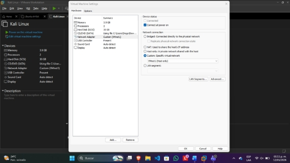
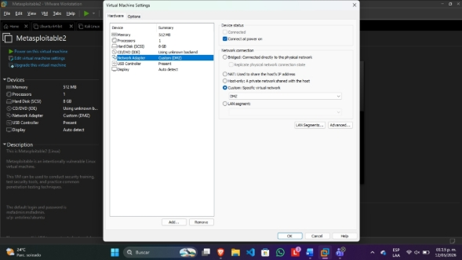
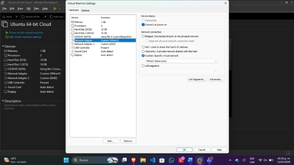
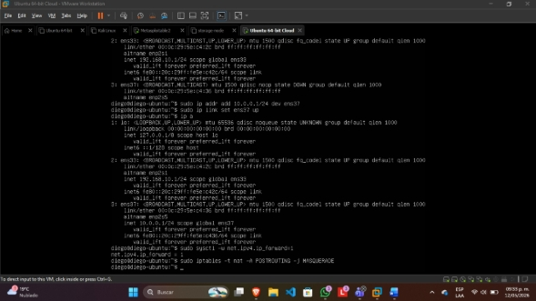
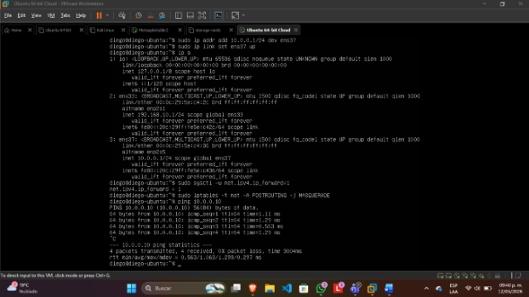
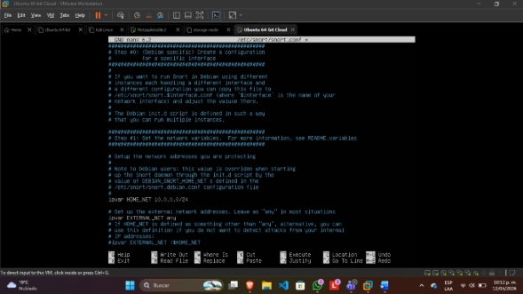
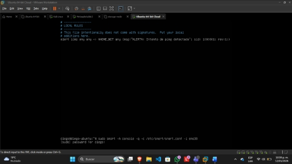
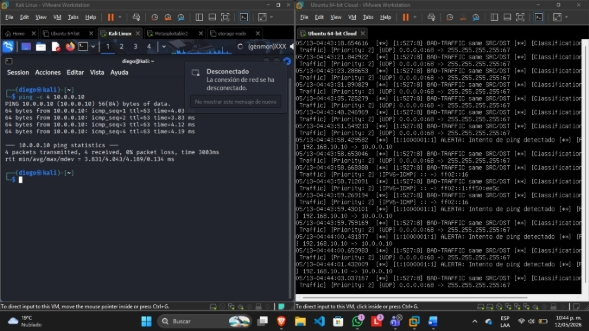
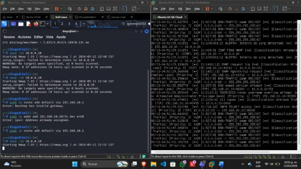

# Despliegue de un Sistema de Detección de Intrusiones (IDS) con Snort en Arquitectura Segmentada

**Autor:** Diego Hernández Vázquez  
**Rol:** Ingeniero de Seguridad / Auditor de Red  
**Tecnologías:** Linux (Ubuntu Server, Kali Linux), Snort IDS, iptables (NAT/Routing), VMware.

---

## Resumen Ejecutivo
Un Sistema de Detección de Intrusiones (IDS) es un componente pasivo y crítico dentro de la arquitectura de Defensa en Profundidad de cualquier organización. A diferencia de un Firewall tradicional, el IDS monitoriza y analiza el tráfico de red en tiempo real, comparando los paquetes contra una base de datos de firmas para alertar sobre brechas, escaneos maliciosos o tráfico no autorizado sin interrumpir el flujo legítimo.

El objetivo de este proyecto es implementar el motor **Snort** en un nodo centralizado (Gateway) dentro de una topología de red segmentada. Esto garantiza una visibilidad absoluta sobre el tráfico "Norte-Sur" (entre una red externa y una DMZ) para auditar y registrar vectores de ataque simulados antes de que comprometan activos críticos.

---

## Alcance del Proyecto
* **Diseño de Arquitectura:** Despliegue de un entorno virtualizado aislado con segmentos lógicos definidos (`Red_Atacante` y `DMZ`).
* **Configuración de Gateway:** Aprovisionamiento de un servidor Linux habilitando enrutamiento (`IP Forwarding`) y enmascaramiento NAT para forzar el flujo de tráfico por un cuello de botella auditado.
* **Hardening y Detección:** Instalación de Snort, delimitación de la variable `HOME_NET` y creación de reglas personalizadas (`local.rules`) basadas en firmas.
* **Emulación de Amenazas:** Ejecución de reconocimiento activo (Ping) y escaneo agresivo de vulnerabilidades (Nmap) desde una máquina ofensiva para validar la interceptación de alertas.

---

## Arquitectura y Metodología de Implementación

### Fase 1: Aprovisionamiento de Infraestructura Virtualizada
Se diseñó la topología de red asignando tarjetas e interfaces específicas para aislar los entornos y forzar la comunicación a través del nodo central (Ubuntu Server).

*Figura 1: Interfaz de red de la máquina atacante (Kali Linux).*

*Figura 2: Interfaz de red del activo vulnerable en DMZ (Metasploitable 2).*

*Figura 3: Configuración dual de red en el nodo central (Ubuntu Server).*

### Fase 2: Configuración de Enrutamiento y NAT en el Gateway
Para permitir la comunicación bidireccional auditada, se configuró el servidor Ubuntu como router intermedio, activando el reenvío de paquetes a nivel de kernel y aplicando reglas de `iptables`.

*Figura 4: Activación de IP Forwarding y configuración de NAT.*

Se validó la conectividad mediante trazas ICMP (Ping) confirmando el enlace exitoso entre el atacante y la víctima a través del Gateway.

*Figura 5: Validación de enrutamiento exitoso.*

### Fase 3: Instalación de Snort y Parametrización de Reglas
Tras la instalación de las dependencias de Snort, se procedió a la configuración del motor de detección:
1.  **Definición del Perímetro:** Se modificó el archivo de configuración principal para establecer la variable `HOME_NET`, indicándole al IDS qué segmento IP debía proteger.
2.  **Inyección de Firmas:** Se añadieron reglas personalizadas en el archivo `local.rules` para identificar y etiquetar específicamente escaneos ICMP originados desde redes externas.

*Figura 6: Modificación de la red interna en la configuración de Snort.*

*Figura 7: Creación de firmas de detección personalizadas.*

### Fase 4: Emulación de Amenazas y Monitoreo en Vivo
Con el IDS ejecutándose en modo consola en el Gateway, se procedió a lanzar ataques simulados desde el nodo ofensivo.

**Vector 1: Reconocimiento ICMP**
Se lanzó un barrido de pings. Snort interceptó los paquetes y generó las alertas configuradas en tiempo real.

*Figura 8: Consola de Snort registrando intentos de reconocimiento ICMP.*

**Vector 2: Escaneo de Superficie con Nmap**
Se ejecutó un escaneo agresivo de versiones (`nmap -sV`). El IDS detectó la anomalía de tráfico y registró las firmas correspondientes al barrido de puertos.

*Figura 9: Snort detectando y clasificando el escaneo de Nmap.*

---

## Resolución de Incidentes (Troubleshooting)

Durante el despliegue de la arquitectura, se presentaron y resolvieron exitosamente bloqueos críticos a nivel de sistema y red:

* **Conflictos de Enrutamiento en Nodo Ofensivo:** Se detectó el error `Nexthop has invalid gateway` en Kali Linux. El diagnóstico reveló que el demonio gráfico (`NetworkManager`) sobrescribía las configuraciones estáticas inyectadas por terminal. **Mitigación:** Se manipuló la jerarquía de los servicios de red para forzar y priorizar las rutas manualmente, estabilizando el enlace.
* **Fallo de Resolución de Nombres (DNS) en NAT:** Al proveer acceso a Internet temporal vía NAT para actualizar los repositorios de Snort, el sistema falló en la descarga de paquetes en un entorno segmentado. **Mitigación:** Se inyectaron configuraciones de servidores DNS públicos directamente en el archivo `/etc/resolv.conf` y se forzaron las peticiones de `apt` a través de IPv4 de forma explícita.

---

## Conclusión
El despliegue validó la eficacia operativa de Snort como sistema de alerta temprana. Al segmentar la topología y forzar el tráfico a través de un Gateway central, se demostró la capacidad de interceptar, analizar y clasificar tráfico malicioso en tiempo real, proporcionando visibilidad crítica para la respuesta a incidentes de seguridad.

---
**Referencias y Documentación Oficial:**
* [Fortinet: ¿Qué son los sistemas de detección de intrusiones (IDS)?](https://www.fortinet.com/lat/resources/cyberglossary/intrusion-detection-system)
* *Documentación técnica sobre resolución DNS y enrutamiento en entornos Linux (ServerFault / StackExchange).*